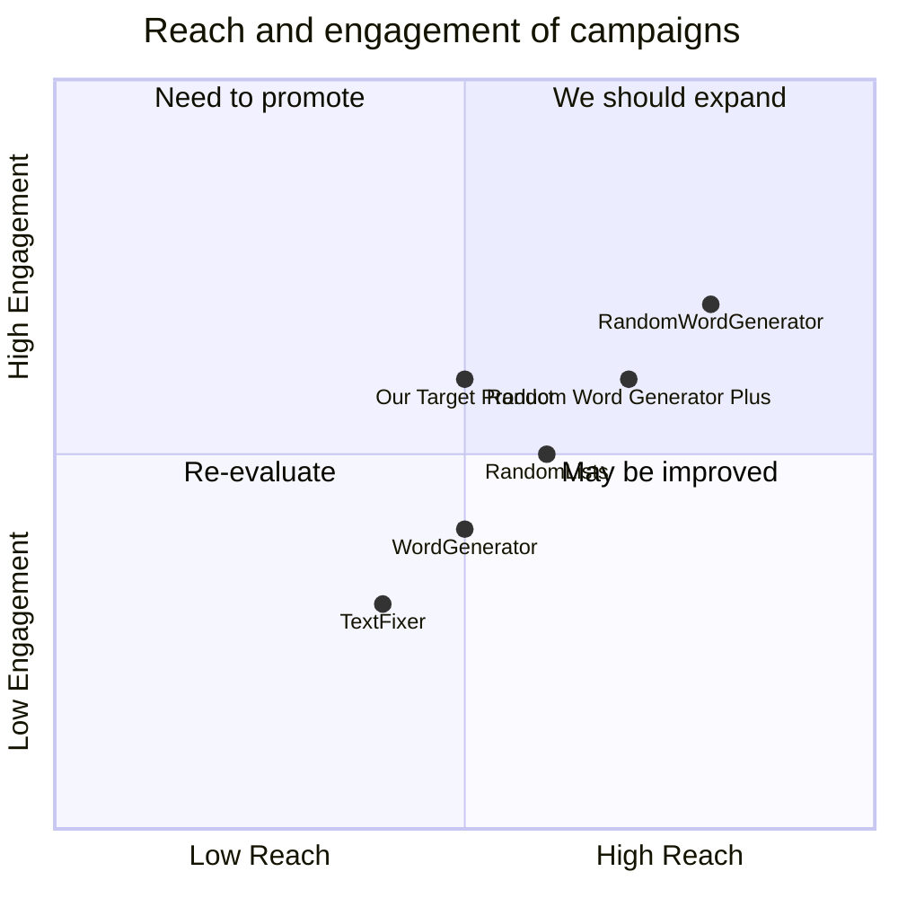

## Original Requirements
The boss wants to create a simple desktop GUI application in Python using the Tkinter library. The application will serve as a random word generator. When the program is run, the user should see a window containing a random word displayed prominently and a Start button underneath. Upon clicking the Start button, the program should generate a new random word and display it where the previous word was, at a frequency of one word per second. The Start button should change to a Stop button once clicked, and clicking the Stop button should pause the random word generation, leaving the last generated word displayed. The code should be simple and straightforward.

## Product Goals
```python
[
    "Develop a simple and user-friendly GUI application",
    "Implement a random word generator",
    "Provide Start and Stop functionality for word generation"
]
```

## User Stories
```python
[
    "As a user, I want to see a random word displayed when I open the application",
    "As a user, I want to generate a new random word every second by clicking the Start button",
    "As a user, I want to pause the word generation by clicking the Stop button",
    "As a user, I want the last generated word to remain displayed when I stop the word generation"
]
```

## Competitive Analysis
```python
[
    "Random Word Generator Plus: This application offers additional features like word length selection and word type selection",
    "WordGenerator: This application provides a list of random words instead of one word at a time",
    "RandomLists: This online tool generates random words and also offers other types of random generators",
    "TextFixer: This online tool generates random words and allows users to select the number of words to generate",
    "RandomWordGenerator: This application offers additional features like generating random sentences and paragraphs"
]
```

## Competitive Quadrant Chart


## Requirement Analysis
The product should be a simple desktop GUI application in Python using the Tkinter library. It should display a random word prominently with a Start and Stop button for controlling the word generation. The word generation should occur at a frequency of one word per second.

## Requirement Pool
```python
[
    ("Develop a GUI application using Python and Tkinter", "P0"),
    ("Implement a random word generator", "P0"),
    ("Display a random word prominently on the GUI", "P0"),
    ("Implement Start and Stop buttons for controlling word generation", "P0"),
    ("Generate a new word at a frequency of one word per second", "P0")
]
```

## UI Design draft
The application will have a simple and clean design. It will have a large display area at the top for displaying the random word. Below the display area, there will be a Start button. Once clicked, the Start button will change to a Stop button. The buttons will be large and easy to click.

## Anything UNCLEAR
There are no unclear points. The requirements are straightforward and well-defined.