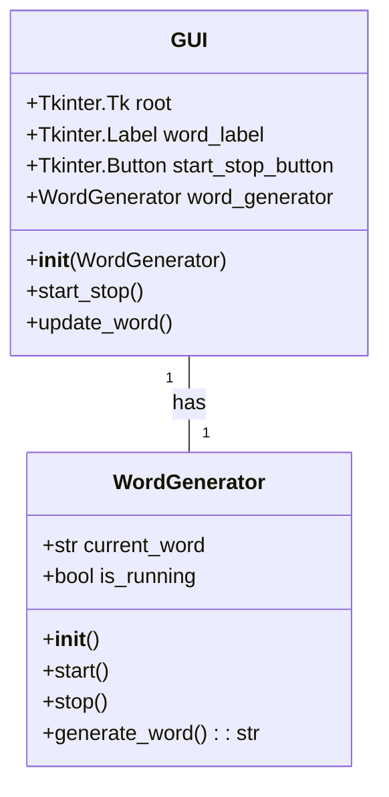
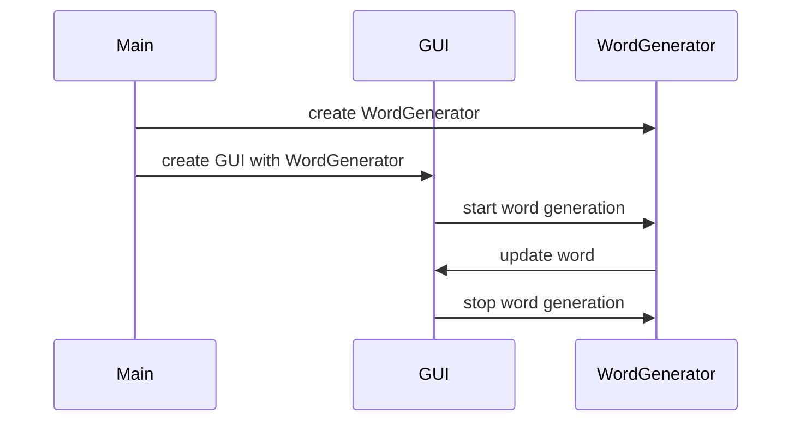

## Implementation approach
We will use the Tkinter library to create the GUI for our application. Tkinter is a standard Python interface to the Tk GUI toolkit and is included with Python as a standard library which makes it a good choice for this project. We will also use the random-word library to generate random words. This library allows us to generate random English words which is exactly what we need for our application. The difficult part of this project is to implement the functionality of generating a new word every second and stopping the generation when the stop button is clicked. We will use Python's threading library to achieve this. We will create a new thread for the word generation which will allow us to start and stop the generation without blocking the main thread which is responsible for the GUI.

## Python package name
```python
"random_word_generator"
```

## File list
```python
[
    "main.py",
    "word_generator.py",
    "gui.py"
]
```

## Data structures and interface definitions


## Program call flow


## Anything UNCLEAR
The requirement is clear to me.